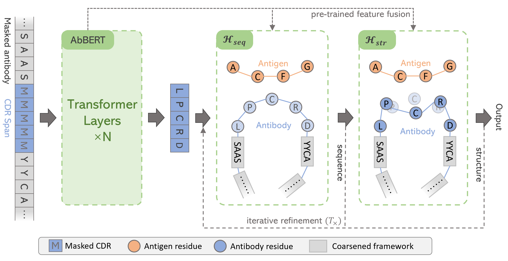

<h1 align="center">
Pre-training Antibody Language Models for Antigen-Specific Computational Antibody Design
</h1>

<div align="center">

[](https://dl.acm.org/doi/abs/10.1145/3580305.3599468)
[](https://github.com/KyGao/ABGNN)
[](https://drive.google.com/file/d/1gKHsWUt_uqfFOKbhJDKln9M6gp4Z2xWa/view?usp=sharing) 
[](https://drive.google.com/file/d/1em-WqXw6olCENOttQRSNWwZWa2xDHuFC/view?usp=sharing)
</div>

## Introduction

<p align="center"></p>
<p align="center"><b>Schematic illustration of the ABGNN framework</b></p>


The AbBERT is the pre-trained antibody model. Its `soft' prediction will be fed into the sequence GNN $\cal{H}$<sub>seq</sub>, after encoding and generating the updated sequence, structure GNN $\cal{H}$<sub>str</sub> encodes the updated graph and then predict the structures. The sequence and structure prediction iteratively refine $T$ times.

## Dependencies

- pytorch==1.12.0
- fairseq==0.10.2
- numpy==1.23.3

## Pretrain a model on sequence data

We collected all paired and unpaired data from [OAS Database](https://opig.stats.ox.ac.uk/webapps/oas/oas) using the provided scripts. We extracted the antibody sequences along with their CDR tags. Then we randomly split the dataset into three subsets: 1000 for validation, 1000 for testing, and the remaining for training. After processing, we obtained the following files: `seq.train.tokens`, `seq.valid.tokens`, `seq.test.tokens` and corresponding `tag.train.tokens`, `tag.valid.tokens`, `tag.test.tokens`. Finally, we preprocess these files into fairseq binary files using following scripts.

```shell
bash pretrain-preprocess.sh
```

The processed fairseq tokens can be downloaded at [abgnn/fairseq-oas-50m](https://drive.google.com/file/d/1em-WqXw6olCENOttQRSNWwZWa2xDHuFC/view?usp=sharing)

When training, we can run:

```shell
bash pretrain-abbert.sh
```

The pre-trained model checkpoints can be downloaded at [this link](https://drive.google.com/file/d/1gKHsWUt_uqfFOKbhJDKln9M6gp4Z2xWa/view?usp=sharing)

## Finetune on sequence and structure co-design tasks

For experiment 1, we refer to the preprocessing scripts in [MEAN](https://github.com/THUNLP-MT/MEAN) and convert it to jsonl files, similar to experiment 2. For experiment 2, We directly use data from [HSRN](https://github.com/wengong-jin/abdockgen). For experiment 3, we follow the setting in [RefineGNN](https://github.com/wengong-jin/RefineGNN). 

Notebly, in experiment 3, we have to finetune on dataset [abgnn/finetune/exp3-sabdab](https://drive.google.com/file/d/1em-WqXw6olCENOttQRSNWwZWa2xDHuFC/view?usp=sharing) and use the saved model to further finetune with script `covid-optimize.sh`. Since the dataset only contain antibody, we have to use a version without antigen encoding.

The processed finetune dataset in jsonl format can be downloaded at [abgnn/finetune](https://drive.google.com/file/d/1em-WqXw6olCENOttQRSNWwZWa2xDHuFC/view?usp=sharing), where the 10-fold validation split in MEAN is also provided in `abgnn/finetune/mean_exp1_for_abgnn`.

The finetuning scripts are following:

```shell
# for exp1
bash finetune-exp1.sh

# for exp2
bash finetune-exp2.sh

# for exp3
# have to additionally install pytorch_lightning, matplotlib, and igfold
bash finetune-exp3.sh
bash covid-optimize.sh
```

We can simply run the following code for inference:

```shell
python inference.py \
    --cdr_type ${CDR} \
    --cktpath ${model_ckpt_path}}/checkpoint_best.pt \
    --data_path ${dataset_path}
```

## License

This work is under [MIT License](LICENSE)

## Citation

If you find this code useful in your research, please consider citing:

```
@inproceedings{gao2023pre,
  title={Pre-training Antibody Language Models for Antigen-Specific Computational Antibody Design},
  author={Gao, Kaiyuan and Wu, Lijun and Zhu, Jinhua and Peng, Tianbo and Xia, Yingce and He, Liang and Xie, Shufang and Qin, Tao and Liu, Haiguang and He, Kun and others},
  booktitle={Proceedings of the 29th ACM SIGKDD Conference on Knowledge Discovery and Data Mining},
  pages={506--517},
  year={2023}
}
```
